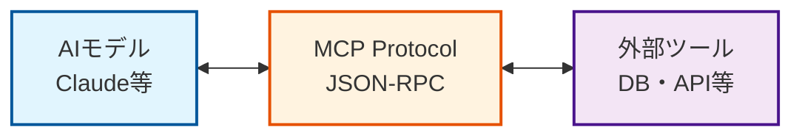

<div align="center">

# 🚀 Awesome-MCP-JP

### 日本の開発者向けMCPリソース集

<p align="center">
  
</p>

[](https://awesome.re)
[](https://opensource.org/licenses/MIT)
[](https://github.com/skypoc/Awesome-MCP-JP/stargazers)
[](https://github.com/skypoc/Awesome-MCP-JP/issues)
[](http://makeapullrequest.com)

**AIの可能性を無限に広げる、MCPリソース集** 🇯🇵


</div>

---

## 📌 このプロジェクトについて

**Awesome-MCP-JP** は、日本の開発者やAI愛好家のために厳選された、**モデルコンテキストプロトコル（MCP）** の包括的なリソース集です。

MCPの基本概念から実践的なツール、活発なコミュニティまで、AIを「賢い対話相手」から「実務をこなすパートナー」へと進化させるための情報がすべて揃っています。

### ✨ なぜAwesome-MCP-JPなのか？

- 🎯 **日本語完全対応** - 日本の開発者のニーズに特化
- 🔍 **厳選されたリソース** - 品質と実用性を重視してキュレーション
- 🚀 **即座に使える** - すぐに試せるサンプルとガイド付き
- 🔒 **セキュリティ重視** - 各ツールのセキュリティレビュー済み

---

## 🎯 クイックスタート

MCPを**今すぐ**始めたい方へ：

```bash
# 1. MCPクライアントをインストール（例：Cherry Studio）
# 2. 無料のAI APIを取得（Gemini推奨）
# 3. お好みのMCPサーバーを選んで設定
```

詳細は[インストールガイド](#mcpインストール方法)をご覧ください。

---

## 📚 目次

- [🤖 MCPとは何か？](#-mcpとは何か-what-is-mcp)
- [🌟 MCPで何ができるのか？](#mcpで何ができるのか)
- [⚡ MCPを使用するために必要なもの](#mcpを使用するために必要なもの)
- [💻 MCPクライアント](#mcpクライアント)
- [🎁 無料で入手できるAI API](#無料で入手できるai-api)
- [📥 MCPインストール方法](#mcpインストール方法)
- [🔧 MCPサーバー厳選リスト](#mcpサーバー厳選リスト)
- [📝 貢献について](#貢献について)

---

## ⚠️ 重要な注意事項

<div align="center">

| ⚠️ **セキュリティに関する重要なお知らせ** |
|:---|
| 1. AIは100%安全ではありません |
| 2. MCPサーバーも100%セキュアではありません。ほとんどのコードをレビューしましたが、これは現時点（2025年7月）でのセキュリティ評価にすぎません |
| 3. **AIの出力を確認し、MCPの安全性を検証することは、ご自身の責任です** |

</div>

---

## 🤖 MCPとは何か？ (What is MCP?)

**モデルコンテキストプロトコル（Model Context Protocol）** は、Anthropic社が2024年11月に発表した革新的なオープン通信規格です。

### 💡 一言で表すと

> AIモデルに外部のツールやデータ、システムとシームレスに対話させるための「**超高性能な接続ケーブル**」

### 🎭 例えると

AIが非常に賢いけれど引きこもりの天才だとします。MCPは、その天才のために：
- 📚 外部から情報（データ）を届ける
- 🛠️ 代わりに作業（ツールの実行）をこなす
- 🤝 信頼できる「執事」や「アシスタント」の役割を果たす

### 🎯 目的

AIを単なるチャットボットから、以下のような実務をこなせる「**実務家**」へと進化させること：
- 📊 データベースの検索
- 📧 メールの送信
- 🔧 コードの自動修正
- 🎨 3Dモデルの作成

### 🔄 MCPの仕組み



**主な特徴：**
- 🔧 **標準化** - すべてのAIとツールが同じ「言語」で通信
- 🔄 **双方向通信** - AIがツールを呼び出し、結果を受け取る
- 🚀 **拡張性** - 新しいツールやサービスを簡単に追加可能

詳細は[公式ドキュメント](https://www.anthropic.com/news/model-context-protocol)をご覧ください。

---

## 🌟 MCPで何ができるのか？

MCPは、AIに「手足」を与え、デジタル世界と対話させるための魔法の杖です。

### 🛠️ デジタルツールの操作

AIがあなたに代わって、日常的に使用するアプリケーションを操作します：

| カテゴリ | できること | 例 |
|:---:|:---|:---|
| 💬 | **コミュニケーション** | LINE、Slackにメッセージを投稿 |
| 🌐 | **翻訳** | DeepLでドキュメントを翻訳 |
| 🔊 | **音声合成** | VoiceVoxで自然な日本語音声に変換 |

### 📡 リアルタイムな情報へのアクセス

| カテゴリ | できること | 例 |
|:---:|:---|:---|
| ☀️ | **天気予報** | 「今日の東京の天気は？」→ 最新情報を取得 |
| 💹 | **金融情報** | 最新の株価取得、決済サービス連携 |
| 🔍 | **Web検索** | トピックを検索し、結果を要約 |

### 👨‍💻 専門的なタスクの実行

| カテゴリ | できること | 例 |
|:---:|:---|:---|
| 💻 | **開発** | コード作成、デバッグ、GitHub連携 |
| 📊 | **分析** | データベースクエリ、グラフ可視化 |
| ✍️ | **コンテンツ制作** | 日本語校正、古典文学検索 |

---

## ⚡ MCPを使用するために必要なもの


| 必要なもの | 説明 |
|:---:|:---|
| **1️⃣ MCPクライアント** | AIと対話し、MCPサーバーを呼び出すための「操作パネル」 |
| **2️⃣ AI API** | AIモデルにアクセスするためのAPI（無料オプションあり） |


---

## 💻 MCPクライアント

MCPクライアントは、AIと対話し、MCPサーバーを呼び出すための「操作パネル」です。

> 💡 **注意**: MCPクライアントを使用するには、自分のAI APIが必要です。後述の無料APIセクションをご覧ください。

### 🌟 主要クライアント

<table>
<tr>
<th>クライアント</th>
<th>特徴</th>
<th>おすすめ度</th>
</tr>

<tr>
<td>

**[Claude Desktop](https://docs.anthropic.com)**
<br>


</td>
<td>

- Claude公式デスクトップ版
- 初心者でも使いやすい
- 様々なMCPサーバーと接続可能
- [セットアップガイド](https://modelcontextprotocol.io/quickstart/user)

</td>
<td align="center">⭐⭐⭐⭐⭐</td>
</tr>

<tr>
<td>

**[Cherry Studio](https://github.com/CherryHQ/cherry-studio)**
<br>


</td>
<td>

- ビジュアル設定対応
- クリックで簡単設定
- 日本語対応良好
- 開発活発

</td>
<td align="center">⭐⭐⭐⭐</td>
</tr>

<tr>
<td>

**[Cursor](https://cursor.sh/)**
<br>


</td>
<td>

- 開発者向けコードエディタ
- コーディング、Slack連携、画像生成を統合
- MCPで万能ツールに

</td>
<td align="center">⭐⭐⭐⭐</td>
</tr>

</table>


- **[ChatWise](https://chatwise.app/)** - オフライン動作可能、マルチモーダル対応
- **[ChatMCP](https://github.com/daodao97/chatmcp)** - クロスプラットフォーム対応
- **[Cline](https://github.com/cline/cline)** - VS Code拡張、日本語完備
- **[DeepChat](https://github.com/ThinkInAIXYZ/deepchat)** - 多機能プラットフォーム
- **[5ire](https://5ire.app/)** - ローカル知識ベースサポート


その他のクライアントは[awesome-mcp-clients](https://github.com/punkpeye/awesome-mcp-clients)をご覧ください。

---

## 🎁 無料で入手できるAI API

### 🌐 [OpenRouter](https://openrouter.ai/)

<div align="center">

| 特徴 | 説明 |
|:---:|:---|
| 🔢 **350種類以上のモデル** | OpenAI、Anthropic、Google、DeepSeekなど主要プロバイダーを網羅 |
| 🔑 **統一API** | 単一のエンドポイントとAPIキーですべてのモデルにアクセス |
| 💰 **コスト最適化** | モデル料金を比較し、最適なものを選択 |
| 🛡️ **高可用性** | 自動フォールバック機能付き |

</div>

**無料入手方法**: 
1. [無料モデルページ](https://openrouter.ai/models?q=free)にアクセス
2. アカウント登録（支払い情報不要）
3. APIキーを取得して即利用開始

### 💎 [Gemini](https://aistudio.google.com/)

<div align="center">

| 特徴 | 説明 |
|:---:|:---|
| 🧠 **マルチモーダル** | テキスト・画像・音声・動画・コードを統合処理 |
| 🏆 **高性能** | MMLU 90%達成、人間専門家平均を上回る |
| 🆓 **無料枠** | 個人利用に十分な無料枠を提供 |

</div>

<details>
<summary>📋 無料APIキー取得手順</summary>

1. [Google AI Studio](https://aistudio.google.com)にアクセス
2. Googleアカウントでサインイン
3. 「Get API key」をクリック
4. 「Create API Key」を選択
5. 「Create API key in new project」→「Copy」
6. APIキーを安全な場所に保存

</details>

---

## 📥 MCPインストール方法

ここでは[Cherry Studio](https://github.com/CherryHQ/cherry-studio)を例に説明します。

### 🚀 ステップバイステップガイド

<table>
<tr>
<td width="50%">

#### 1️⃣ Cherry Studioをダウンロード
[公式リリースページ](https://github.com/CherryHQ/cherry-studio/releases)から最新版をダウンロード

#### 2️⃣ AI APIを設定
設定画面で対応するAPIプロバイダーを選択し、APIキーを入力

</td>
<td width="50%">


</td>
</tr>

<tr>
<td>

#### 3️⃣ MCP環境をインストール
左側のサイドバーの「MCPサーバー」オプションを選択してください。
右上の赤い感嘆符をクリックし、指示に従って環境をセットアップ

</td>
<td>


</td>
</tr>

<tr>
<td>

#### 4️⃣ MCPサーバーを追加
例：[Fetch](https://mcp.so/server/fetch/modelcontextprotocol)のコード

サーバー追加→JSONからインポート

MCPページからJSONコードをコピーして貼り付け

MCPサーバーのスイッチをオンにする


</td>
<td>


</td>
</tr>

<tr>
<td>

#### 5️⃣ 使用開始
チャットボックスでMCPサーバーを選択して利用開始

</td>
<td>


</td>
</tr>
</table>

---

## 🔧 MCPサーバー厳選リスト

世界中の開発者によって作成されたMCPサーバーから、特に有用で安定しているものを厳選しました。

### ⭐ 個人的なおすすめ

<table>
<tr>
<th width="30%">サーバー</th>
<th>説明</th>
<th width="15%">カテゴリ</th>
</tr>

<tr>
<td>

**[DuckDuckGo](https://github.com/nickclyde/duckduckgo-mcp-server)**

</td>
<td>プライバシー重視の検索エンジン。コンテンツ取得・解析機能付き</td>
<td align="center">🔍 検索</td>
</tr>

<tr>
<td>

**[Brave Search](https://brave.com/search/api/guides/use-with-claude-desktop-with-mcp/)**

</td>
<td>Braveの検索APIでWeb・ローカル検索を実行</td>
<td align="center">🔍 検索</td>
</tr>

<tr>
<td>

**[Sequential Thinking](https://github.com/modelcontextprotocol/servers/tree/main/src/sequentialthinking)**

</td>
<td>構造化された思考プロセスで動的な問題解決を支援</td>
<td align="center">🧠 AI</td>
</tr>

<tr>
<td>

**[Playwright MCP](https://github.com/microsoft/playwright-mcp)**

</td>
<td>Microsoft公式。Webページを精密に制御してデータ収集</td>
<td align="center">🌐 Web</td>
</tr>

<tr>
<td>

**[Basic Memory](https://github.com/basicmachines-co/basic-memory)**

</td>
<td>永続的セマンティックグラフ構築。Obsidian.md統合</td>
<td align="center">🧠 メモリ</td>
</tr>

</table>

### 🌐 ブラウザの自動化とウェブサイトとのインタラクション

| 名称                                                           | 説明                                                           |
|--------------------------------------------------------------|--------------------------------------------------------------|
| [automatalabs/mcp-server-playwright](https://github.com/Automata-Labs-team/MCP-Server-Playwright) | Playwrightを使用してブラウザ自動化を行うためのMCPサーバーです。                       |
| [blackwhite084/playwright-plus-python-mcp](https://github.com/blackwhite084/playwright-plus-python-mcp) | Playwrightを利用したPython製MCPサーバーで、特にLLMとの連携に最適化されています。          |
| [browserbase/mcp-server-browserbase](https://github.com/browserbase/mcp-server-browserbase) | クラウドベースのブラウザ自動化サービス。Webページのナビゲーション、データ抽出、フォーム入力などをローカルインストール不要で実行できます。 |
| [browsermcp/mcp](https://github.com/browsermcp/mcp)          | ローカル環境のChromeブラウザを自動操作します。                                   |
| [co-browser/browser-use-mcp-server](https://github.com/co-browser/browser-use-mcp-server) | `browser-use`をSSE転送に対応したMCPサーバーとしてパッケージ化。Dockerfileも含まれています。 |
| [executeautomation/playwright-mcp-server](https://github.com/executeautomation/mcp-playwright) | Playwrightを用いてブラウザの自動化とWebスクレイピングを行うMCPサーバーです。               |
| [eyalzh/browser-control-mcp](https://github.com/eyalzh/browser-control-mcp) | ブラウザ拡張機能と連携し、LLMクライアントがユーザーのFirefoxブラウザを制御できるようにします。         |
| [Firecrawl](https://github.com/mendableai/firecrawl-mcp-server) | Firecrawlを利用してWebページからデータを抽出。JavaScriptで描画される動的なページにも対応します。  |
| [jae-jae/fetcher-mcp](https://github.com/jae-jae/fetcher-mcp) | PlaywrightヘッドレスブラウザでWebページを取得。JSレンダリングとインテリジェントな抽出（Markdown/HTML）に対応。 |
| [microsoft/playwright-mcp](https://github.com/microsoft/playwright-mcp) | Microsoft公式MCP。Playwrightを利用し、AIがWebページを精密に制御してデータを自動的に収集します。 |
| [modelcontextprotocol/server-fetch](https://github.com/modelcontextprotocol/servers/tree/main/src/fetch) | 公式リファレンス実装。Webコンテンツ（HTML/JSON/MD）を柔軟に取得し、AIでの処理に最適化します。      |
| [RAG Web Browser](https://github.com/apify/mcp-server-rag-web-browser) | Apifyのオープンソースツール。Web検索を実行し、URLをスクレイピングしてMarkdown形式で内容を返します。  |
| [ryoppippi/sitemcp](https://github.com/ryoppippi/sitemcp)    | Webサイト全体をクロールし、それをMCPサーバーとして利用可能にします。                        |

### 💻 開発

| 名称                                                           | 紹介                                                           |
|--------------------------------------------------------------|--------------------------------------------------------------|
| [Automata-Labs-team/code-sandbox-mcp](https://github.com/Automata-Labs-team/code-sandbox-mcp) | 安全なDockerコンテナ環境を作成してコードを実行します。                               |
| [bazinga012/code-executor](https://github.com/bazinga012/mcp_code_executor) | AI が指定された Conda 環境で Python コードを実行できるようにします。                  |
| [biegehydra/VSCode Devtools](https://github.com/biegehydra/BifrostMCP) | VSCode IDE に接続し、`find_usages` などのセマンティックツールを使用します。           |
| [E2B](https://github.com/e2b-dev/mcp-server)                 | E2B が提供する安全なクラウドサンドボックスでコードを実行します。                           |
| [ezyang/codemcp](https://github.com/ezyang/codemcp)          | 基本的な読み取り、書き込み、およびコマンドラインツールを備えたコーディングエージェント。                 |
| [ForeverVM](https://github.com/jamsocket/forevervm/tree/main/javascript/mcp-server) | コードサンドボックスで Python コードを実行します。                                |
| [idosal/git-mcp](https://github.com/idosal/git-mcp)          | あらゆる GitHub リポジトリまたはプロジェクトに接続してドキュメントを取得するための汎用リモート MCP サーバー。 |
| [mem0ai/mem0-mcp](https://github.com/mem0ai/mem0-mcp)        | コードの好みとパターンを管理し、セマンティック検索をサポートし、IDE で技術ドキュメントを簡単に保存および取得できるようにします。(Mem0 公式) |
| [oraios/serena](https://github.com/oraios/serena)            | 言語サーバーを使用したシンボリックなコード操作に依存する、機能豊富なコーディングエージェント。              |
| [pydantic/pydantic-ai/mcp-run-python](https://github.com/pydantic/pydantic-ai/tree/main/mcp-run-python) | Pydantic 製。安全なサンドボックス環境で Python コードを実行し、プログラミングエージェントの開発に適しています。 |
| [Semgrep](https://github.com/semgrep/mcp)                    | AI エージェントが Semgrep を使用してコードのセキュリティスキャンを実行できるようにします。(Semgrep 公式) |
| [tumf/mcp-text-editor](https://github.com/tumf/mcp-text-editor) | 行指向のテキストファイルエディタ。効率的な部分的なファイルアクセスにより、トークンの使用を最小限に抑えるように LLM ツール向けに最適化されています。 |
| [vivekVells/mcp-pandoc](https://github.com/vivekVells/mcp-pandoc) | Pandoc を使用して、シームレスなドキュメント形式変換（Markdown、HTML、PDF、DOCX、CSV など）を行います。 |
| [wonderwhy-er/DesktopCommanderMCP](https://github.com/wonderwhy-er/DesktopCommanderMCP) | 強化されたファイルシステムと検索ツール、およびコーディング固有のコマンドとプロンプト。(コマンドライン機能も含む)    |
| [yzfly/mcp-python-interpreter](https://github.com/yzfly/mcp-python-interpreter) | コード実行、環境およびパッケージ管理をサポートする、安全で標準化された Python 環境。               |

### 🛠 コマンドを実行

| 名称                                                           | 紹介                                                           |
|--------------------------------------------------------------|--------------------------------------------------------------|
| [g0t4/mcp-server-commands](https://github.com/g0t4/mcp-server-commands) | `run_command` と `run_script` ツールを使用して、あらゆるコマンドを実行します。        |
| [iTerm MCP](https://github.com/ferrislucas/iterm-mcp)        | macOSのiTerm2ターミナルと統合し、AIがターミナルコマンドを実行・監視できるようにします。           |
| [MladenSU/cli-mcp-server](https://github.com/MladenSU/cli-mcp-server) | 安全な実行とカスタマイズ可能なセキュリティポリシーを備えたコマンドラインインターフェース。                |
| [tumf/mcp-shell-server](https://github.com/tumf/mcp-shell-server) | モデルコンテキストプロトコル（MCP）を実装した、安全なシェルコマンド実行サーバーです。                 |
| [Windows CLI](https://github.com/SimonB97/win-cli-mcp-server) | Windowsシステム上でコマンドライン（PowerShell、CMD、Git Bash）を安全に実行します。      |
| [wonderwhy-er/DesktopCommanderMCP](https://github.com/wonderwhy-er/DesktopCommanderMCP) | プログラムの管理・実行、コードやテキストファイルの読み書き・検索・編集が可能な多機能ツール。(コード/ファイル機能も含む) |

### 🦊 **Git / GitHub / GitLab関連**

| 名称                                                           | 紹介                                                        |
|--------------------------------------------------------------|-----------------------------------------------------------|
| [adhikasp/mcp-git-ingest](https://github.com/adhikasp/mcp-git-ingest) | LLMを使用してGitHubリポジトリを読み込み、分析します。                           |
| [github/github-mcp-server](https://github.com/github/github-mcp-server) | GitHub公式のMCPサーバー。AIがAPI経由でGitHubと深く統合し、自動化ワークフローなどを実現します。 |
| [modelcontextprotocol/server-git](https://github.com/modelcontextprotocol/servers/tree/main/src/git) | 公式リファレンス実装。ローカルGitリポジトリを直接操作し、読み取り、検索、分析を行います。            |
| [modelcontextprotocol/server-github](https://github.com/modelcontextprotocol/servers/tree/main/src/github) | 公式リファレンス実装。GitHub APIと統合し、リポジトリ、ファイル、PR、Issueを管理します。      |
| [modelcontextprotocol/server-gitlab](https://github.com/modelcontextprotocol/servers/tree/main/src/gitlab) | 公式リファレンス実装。GitLab APIと統合し、プロジェクト管理とCI/CD操作を行います。          |
| [Tiberriver256/mcp-server-azure-devops](https://github.com/Tiberriver256/mcp-server-azure-devops) | Azure DevOps API統合用のMCPサーバー。リポジトリ管理、ワークアイテム、パイプライン向け。     |

### 🗄️ Database

| 名称                                                           | 紹介                                                           |
|--------------------------------------------------------------|--------------------------------------------------------------|
| [aliyun/alibabacloud-tablestore-mcp-server](https://github.com/aliyun/alibabacloud-tablestore-mcp-server) | Alibaba Cloud Tablestore の MCP サービスで、ドキュメントの追加、ベクトルおよびスカラーに基づくドキュメントの意味検索、RAG 対応、サーバーレスなどの機能を提供します。 |
| [BigQuery (by LucasHild)](https://github.com/LucasHild/mcp-server-bigquery) | AI により BigQuery データベースのスキーマチェックとクエリ実行を実現します。                 |
| [centralmind/gateway](https://github.com/centralmind/gateway) | MCP および MCP SSE サーバーで、データベースのスキーマやデータに基づいて自動的に API を生成します。PG、Clickhouse、MySQL、Snowflake、BigQuery、Supabase に対応。 |
| [Chroma](https://github.com/chroma-core/chroma-mcp)          | Chroma の公式統合で、埋め込み、ベクトル検索、ドキュメント保存および全文検索を提供します。             |
| [ClickHouse/mcp-clickhouse](https://github.com/ClickHouse/mcp-clickhouse) | ClickHouse の公式統合で、ClickHouse データベースへの接続、クエリ実行およびスキーマチェックを行います。 |
| [DBHub](https://github.com/bytebase/dbhub/)                  | 汎用データベース MCP サーバーで、MySQL、PostgreSQL、SQLite、DuckDB などに対応します。  |
| [domdomegg/airtable-mcp-server](https://github.com/domdomegg/airtable-mcp-server) | Airtable データベースの読み書きとスキーマチェックを行います。                          |
| [FreePeak/db-mcp-server](https://github.com/FreePeak/db-mcp-server) | 高性能なマルチデータベース MCP サーバー (Go) で、MySQL & PG に対応（NoSQL は近日公開）。クエリ、トランザクション、スキーマ探索などのツールを含みます。 |
| [furey/mongodb-lens](https://github.com/furey/mongodb-lens)  | 機能豊富な MongoDB データベース MCP サーバーです。                             |
| [gannonh/firebase-mcp](https://github.com/gannonh/firebase-mcp) | Firebase サービスで、Auth、Firestore、Storage を含みます。                 |
| [isaacwasserman/mcp-snowflake-server](https://github.com/isaacwasserman/mcp-snowflake-server) | Snowflake 統合で、読み取りおよび（オプションで）書き込み操作と洞察トラッキングを実現します。          |
| [kiliczsh/mcp-mongo-server](https://github.com/kiliczsh/mcp-mongo-server) | MongoDB 用のモデルコンテキストプロトコルサーバーです。                              |
| [ktanaka101/mcp-server-duckdb](https://github.com/ktanaka101/mcp-server-duckdb) | DuckDB データベース統合で、スキーマチェックおよびクエリ機能を提供します。                     |
| [googleapis/genai-toolbox](https://github.com/googleapis/genai-toolbox) | Google の公式オープンソース MCP サーバーで、データベース向けにシンプルで迅速かつ安全なツールを提供します。  |
| [milvus](https://github.com/zilliztech/mcp-server-milvus)    | Zilliz/Milvus の公式統合で、Milvus ベクトルデータベース内のデータ検索、クエリおよび操作を行います。 |
| [MotherDuck](https://github.com/motherduckdb/mcp-server-motherduck) | MotherDuck の公式統合で、MotherDuck およびローカル DuckDB を用いてデータのクエリおよび分析を行います。 |
| [Neo4j](https://github.com/neo4j-contrib/mcp-neo4j/)         | Neo4j の公式貢献で、Neo4j グラフデータベース（スキーマ＋読み書き Cypher）の操作およびグラフデータベース対応のメモリ機能を提供します。 |
| [Neon](https://github.com/neondatabase/mcp-server-neon)      | Neon の公式統合で、Neon のサーバーレス Postgres プラットフォームと連携し、データベースの作成と管理を行います。 |
| [qdrant](https://github.com/qdrant/mcp-server-qdrant/)       | Qdrant の公式統合で、Qdrant ベクトル検索エンジンに基づくセマンティックメモリ層を実現します。        |
| [QuantGeekDev/mongo-mcp](https://github.com/QuantGeekDev/mongo-mcp) | MongoDB 統合で、LLM が直接データベースと対話できるようにします。                       |
| [runekaagaard/mcp-alchemy](https://github.com/runekaagaard/mcp-alchemy) | 汎用 SQLAlchemy データベース統合で、PG、MySQL、MariaDB、SQLite、Oracle、MS SQL Server などに対応し、スキーマ／リレーションチェックや大規模データ解析機能を備えています。 |
| [sirmews/mcp-pinecone](https://github.com/sirmews/mcp-pinecone) | Pinecone 統合で、ベクトル検索機能を提供します。                                 |
| [supabase-community/supabase-mcp](https://github.com/supabase-community/supabase-mcp) | Supabase の公式 MCP サーバーで、AI アシスタントを直接 Supabase プロジェクトに接続し、テーブル管理、設定取得、データクエリなどのタスクを実行可能にします。 |
| [weaviate/mcp-server-weaviate](https://github.com/weaviate/mcp-server-weaviate) | Weaviate コレクションに接続して知識ベースとし、チャットメモリストレージとして Weaviate を利用する MCP サーバーです。 |
| [xing5/mcp-google-sheets](https://github.com/xing5/mcp-google-sheets) | Google Sheets と連携するモデルコンテキストプロトコルサーバーで、スプレッドシートの作成、読み取り、更新、管理ツールを提供します。 |

### ☁️ Cloud
| 名称                                                           | 説明                                                           |
|--------------------------------------------------------------|--------------------------------------------------------------|
| [alexei-led/aws-mcp-server](https://github.com/alexei-led/aws-mcp-server) | AIにAWS CLIコマンド（Unixパイプとテンプレート付き）を実行させる軽量サーバーで、Dockerの安全実行（マルチアーキテクチャ対応）をサポート。 |
| [alexei-led/k8s-mcp-server](https://github.com/alexei-led/k8s-mcp-server) | AIがKubernetes CLIコマンド（kubectl、helm、istioctl、argocd）をUnixパイプ付きで安全に実行できる軽量サーバー。Dockerの安全実行（マルチアーキテクチャ対応）をサポート。 |
| [Cloudflare](https://github.com/cloudflare/mcp-server-cloudflare) | Cloudflare公式統合で、Workers/KV/R2/D1を含むCloudflare開発者プラットフォームリソースのデプロイ、設定、クエリを行う。 |
| [flux159/mcp-server-kubernetes](https://github.com/Flux159/mcp-server-kubernetes) | Kubernetesクラスター操作用のTypeScript実装（pods、deployments、services対応）。 |
| [Kubernetes (Go)](https://github.com/strowk/mcp-k8s-go)      | Go言語で実装されたKubernetesサーバーで、Pods、ログ、イベント、ネームスペースなどを閲覧する。       |
| [Kubernetes and OpenShift](https://github.com/manusa/kubernetes-mcp-server) | 高度なKubernetes MCPサーバーで、OpenShiftもサポートし、CRUD操作や専用ツールを提供。      |
| [nwiizo/tfmcp](https://github.com/nwiizo/tfmcp)              | Terraform MCPサーバーで、AIアシスタントがTerraform環境を管理・操作（設定読み込み、プラン解析、適用、状態管理）できる。 |
| [rohitg00/kubectl-mcp-server](https://github.com/rohitg00/kubectl-mcp-server) | Kubernetes用MCPサーバーで、AIアシスタントが自然言語でK8sクラスターと対話できる。            |
| [silenceper/mcp-k8s](https://github.com/silenceper/mcp-k8s)  | AI駆動のKubernetesリソース管理ツールで、自然言語を介してK8sクラスター内のあらゆるリソース（ネイティブ/CRD）を操作できる。 |
| [weibaohui/k8m](https://github.com/weibaohui/k8m)            | MCPによるマルチクラスターKubernetes管理・操作を提供し、管理UI、ログ機能、約50の組み込みツール（標準/CRD対応）を備える。 |
| [weibaohui/kom](https://github.com/weibaohui/kom)            | MCPによるマルチクラスターKubernetes管理・操作を提供し、SDKとしてプロジェクトに組み込める約50の組み込みツール（標準/CRD対応）を含む。 |

### 🔍 検索エンジン
**注意：ほとんどの検索エンジンMCPはAPIの呼び出しが必要です。**
| 名称                                                           | 説明                                                           | API必要  |
|--------------------------------------------------------------|--------------------------------------------------------------|--------|
| [andybrandt/mcp-simple-arxiv](https://github.com/andybrandt/mcp-simple-arxiv) | LLMがarXivで論文を検索・閲覧するMCP。                                     | 必要     |
| [andybrandt/mcp-simple-pubmed](https://github.com/andybrandt/mcp-simple-pubmed) | LLMがPubMedで医学・生命科学論文を検索・閲覧するMCP。                             | 必要     |
| [blazickjp/arxiv-mcp-server](https://github.com/blazickjp/arxiv-mcp-server) | ArXivの研究論文を検索。                                               | 不要     |
| [Brave Search](https://brave.com/search/api/guides/use-with-claude-desktop-with-mcp/) | Braveの検索APIを使用してウェブおよびローカル検索を行う。                             | 必要（無料） |
| [Exa](https://github.com/exa-labs/exa-mcp-server)            | AI特化検索エンジン                                                   | 必要     |
| [genomoncology/biomcp](https://github.com/genomoncology/biomcp) | 生物医学研究用サーバーで、PubMed、ClinicalTrials.gov、MyVariant.infoへのアクセスを提供。 | 必要     |
| [hellokaton/unsplash-mcp-server](https://github.com/hellokaton/unsplash-mcp-server) | Unsplashの画像検索用MCPサーバー。                                       | 必要     |
| [Ihor-Sokoliuk/MCP-SearXNG](https://github.com/ihor-sokoliuk/mcp-searxng) | SearXNGメタ検索エンジンインスタンスに接続。                                    | 不要     |
| [Kagi Search](https://github.com/kagisearch/kagimcp)         | Kagiの検索APIを使用する公式統合で、ウェブ検索を行う。                               | 必要     |
| [mzxrai/mcp-webresearch](https://github.com/mzxrai/mcp-webresearch) | Google検索を行い、あらゆるトピックで深層ウェブリサーチを実施。                           | 不要     |
| [nickclyde/duckduckgo-mcp-server](https://github.com/nickclyde/duckduckgo-mcp-server) | DuckDuckGoを使用したウェブ検索。                                        | 不要     |
| [Perplexity](https://github.com/ppl-ai/modelcontextprotocol) | Perplexityの公式統合で、Perplexity Sonar APIに接続し                    | 必要     |
| [pskill9/web-search](https://github.com/pskill9/web-search)  | APIキー不要で、Google検索結果を使用して無料ウェブ検索を行うMCPサーバー。                   | 不要     |
| [reading-plus-ai/mcp-server-deep-research](https://github.com/reading-plus-ai/mcp-server-deep-research) | OpenAI/Perplexity風の自主深層リサーチ、構造化クエリの精緻化、簡潔なレポートを提供するMCPサーバー。  | 不要     |
| [Search1API](https://github.com/fatwang2/search1api-mcp)     | Search1API公式統合で、検索、スクレイピング、サイトマップ機能を提供するAPI（有料APIキー必要）。      | 必要     |
| [Tavily](https://github.com/tavily-ai/tavily-mcp)            | AIエージェント向けに設計された検索エンジン（検索＋抽出）を提供する公式Tavily統合。                | 必要（無料） |
| [zoomeye-ai/mcp_zoomeye](https://github.com/zoomeye-ai/mcp_zoomeye) | ZoomEyeMCPサーバーを使ってネットワーク資産情報を照会。                             | 必要（無料） |

### 👨‍💼 オフィス
**業務での使用は慎重に行ってください**
| 名称                                                           | 説明                                                           |
|--------------------------------------------------------------|--------------------------------------------------------------|
| [Apple Calendar](https://github.com/Omar-v2/mcp-ical)        | macOSカレンダーと対話し、イベントの作成・変更、スケジュールのリスト、空き時間の検索などを行う。           |
| [chaindead/telegram-mcp](https://github.com/chaindead/telegram-mcp) | Telegram API統合で、ユーザーデータにアクセスし、会話を管理し、メッセージを取得・既読状態を処理する。     |
| [Discord (by v-3)](https://github.com/v-3/discordmcp)        | ボットを介してDiscordサーバーに接続し、チャンネルメッセージを読み書きする。                    |
| [Gmail](https://github.com/GongRzhe/Gmail-MCP-Server)        | 自動認証をサポートするGmail統合                                           |
| [lharries/whatsapp-mcp](https://github.com/lharries/whatsapp-mcp) | 個人のWhatsAppメッセージ、連絡先を検索し、個人またはグループにメッセージを送信するためのMCPサーバー。     |
| [MarkusPfundstein/mcp-gsuite](https://github.com/MarkusPfundstein/mcp-gsuite) | GmailとGoogle Calendarの統合。                                    |
| [softeria/ms-365-mcp-server](https://github.com/softeria/ms-365-mcp-server) | Microsoft 365スイート全体（Graph API）を接続し、メール、ファイル、Excel、カレンダーなどを管理するMCPサーバー。 |
| [Telegram](https://github.com/chigwell/telegram-mcp)         | Telethonを介してTelegramを統合し、チャットをページングして読み取り、メッセージを取得・送信する。     |

### 💴 金融と暗号通貨

**この部分のMCPを自分で検証してください**

**この部分のMCPを自分で検証してください**

**MCPの安全性を確認することは、ご自身の責任です。**

**MCPの安全性を確認することは、ご自身の責任です。**

| 名称                                                           | 説明                                                           |
|--------------------------------------------------------------|--------------------------------------------------------------|
| [AlphaVantage](https://github.com/calvernaz/alphavantage)    | AlphaVantageの株式市場データAPIサーバー。                                 |
| [anjor/coinmarket-mcp-server](https://github.com/anjor/coinmarket-mcp-server) | Coinmarket API統合、暗号通貨のリストと価格を取得。                             |
| [Bankless Onchain](https://github.com/bankless/onchain-mcp)  | ERC20トークン、取引履歴、スマートコントラクトの状態など、オンチェーンデータを照会します。(Bankless公式)  |
| [BICScan](https://github.com/ahnlabio/bicscan-mcp)           | EVMブロックチェーンアドレス（EOA、CA、ENS）やドメインのリスクスコア/資産保有状況を取得します。(BICScan公式) |
| [base/base-mcp](https://github.com/base/base-mcp)            | Base Network統合、オンチェーンツールを提供し、BaseネットワークおよびCoinbase APIと対話します（ウォレット/送金/コントラクト/DeFi）。 |
| [berlinbra/alpha-vantage-mcp](https://github.com/berlinbra/alpha-vantage-mcp) | Alpha Vantage API統合、株式および暗号通貨情報を取得します。                       |
| [bitteprotocol/mcp](https://github.com/BitteProtocol/mcp)    | Bitte Protocol統合、複数のブロックチェーンでAIエージェントを実行します。                 |
| [Bsc-mcp](https://github.com/TermiX-official/bsc-mcp)        | AIをBNBチェーンに接続し、複雑なオンチェーン操作（送金、取引、安全チェックなど）を実行します。            |
| [Chargebee](https://github.com/chargebee/agentkit/tree/main/modelcontextprotocol) | Chargebee公式統合、AIエージェントをChargebee請求プラットフォームに接続します。            |
| [codex-data/codex-mcp](https://github.com/Codex-Data/codex-mcp) | Codex API統合、60以上のネットワーク上でリアルタイムの豊富なブロックチェーンおよび市場データを提供します。   |
| [coinpaprika/dexpaprika-mcp](https://github.com/coinpaprika/dexpaprika-mcp) | CoinpaprikaのDexPaprika MCPサーバー、高性能DexPaprika APIを公開します（20以上のチェーン/5M以上のトークン/リアルタイム価格/流動性/履歴データ）。 |
| [EVM MCP Server](https://github.com/mcpdotdirect/evm-mcp-server) | 30以上のEVMネットワークに対して包括的なブロックチェーンサービスを提供し、トークン、NFT、スマートコントラクト、取引、ENSをサポートします。 |
| [ferdousbhai/investor-agent](https://github.com/ferdousbhai/investor-agent) | Yahoo Finance統合、株式市場データを取得し、オプションの推奨を含みます。                   |
| [ferdousbhai/tasty-agent](https://github.com/ferdousbhai/tasty-agent) | Tastyworks API統合、Tastytradeでの取引活動を処理します。                     |
| [Financial Datasets](https://github.com/financial-datasets/mcp-server) | AIエージェント向けに設計された株式市場API。                                     |
| [getalby/nwc-mcp-server](https://github.com/getalby/nwc-mcp-server) | Nostr Wallet Connectによって駆動されるビットコインライトニングネットワレット統合。          |
| [heurist-network/heurist-mesh-mcp-server](https://github.com/heurist-network/heurist-mesh-mcp-server) | Heurist Meshネットワーク内の専門的なWeb3 AIエージェントにアクセスします（ブロックチェーン分析/コントラクトセキュリティ/トークンメトリクスなど）。 (Heurist公式) |
| [intentos-labs/beeper-mcp](https://github.com/intentos-labs/beeper-mcp) | BeeperはBSC上で取引を提供し、残高/トークン転送、Pancakeswapトークン交換、beeper報酬の受け取りを含みます。 |
| [janswist/mcp-dexscreener](https://github.com/janswist/mcp-dexscreener) | オープンで無料のDexscreener APIを使用してリアルタイムのオンチェーン市場価格を取得します。         |
| [kukapay/crypto-feargreed-mcp](https://github.com/kukapay/crypto-feargreed-mcp) | リアルタイムおよび歴史的な暗号通貨の恐怖と貪欲指数データを提供します。                          |
| [kukapay/crypto-indicators-mcp](https://github.com/kukapay/crypto-indicators-mcp) | 一連の暗号通貨技術分析指標と戦略を提供するMCPサーバー。                                |
| [kukapay/crypto-portfolio-mcp](https://github.com/kukapay/crypto-portfolio-mcp) | 暗号通貨投資ポートフォリオの配分を追跡および管理するためのMCPサーバー。                        |
| [kukapay/crypto-sentiment-mcp](https://github.com/kukapay/crypto-sentiment-mcp) | AIエージェントに暗号通貨の感情分析を提供するMCPサーバー。                              |
| [kukapay/cryptopanic-mcp-server](https://github.com/kukapay/cryptopanic-mcp-server) | AIエージェントに最新の暗号通貨ニュースを提供します（CryptoPanicによって駆動）。               |
| [kukapay/dune-analytics-mcp](https://github.com/kukapay/dune-analytics-mcp) | Dune AnalyticsデータをAIエージェントにブリッジするMCPサーバー。                    |
| [kukapay/freqtrade-mcp](https://github.com/kukapay/freqtrade-mcp) | Freqtrade暗号通貨取引ボットと統合されたMCPサーバー。                             |
| [kukapay/jupiter-mcp](https://github.com/kukapay/jupiter-mcp) | Jupiterの新しいUltra APIを使用してSolanaブロックチェーン上でトークン交換を実行するMCPサーバー。 |
| [kukapay/pancakeswap-poolspy-mcp](https://github.com/kukapay/pancakeswap-poolspy-mcp) | Pancake Swap上の新しく作成されたプールを追跡するMCPサーバー。                       |
| [kukapay/rug-check-mcp](https://github.com/kukapay/rug-check-mcp) | Solanaのミームトークンの潜在的なリスクを検出するMCPサーバー。                          |
| [kukapay/thegraph-mcp](https://github.com/kukapay/thegraph-mcp) | The Graphからのインデックス化されたブロックチェーンデータをAIエージェントに提供するMCPサーバー。      |
| [kukapay/token-minter-mcp](https://github.com/kukapay/token-minter-mcp) | AIエージェントに複数のブロックチェーンでERC-20トークンをミントするツールを提供するMCPサーバー。        |
| [kukapay/token-revoke-mcp](https://github.com/kukapay/token-revoke-mcp) | 複数のブロックチェーンでERC-20トークンの権限を確認および取り消すためのMCPサーバー。               |
| [kukapay/uniswap-poolspy-mcp](https://github.com/kukapay/uniswap-poolspy-mcp) | 複数のブロックチェーンでUniswapの新しく作成された流動性プールを追跡するMCPサーバー。              |
| [kukapay/uniswap-trader-mcp](https://github.com/kukapay/uniswap-trader-mcp) | AIエージェントが複数のブロックチェーンでUniswap DEXトークン交換を自動化するためのMCPサーバー。      |
| [kukapay/whale-tracker-mcp](https://github.com/kukapay/whale-tracker-mcp) | 暗号通貨のクジラ取引を追跡するためのMCPサーバー。                                   |
| [laukikk/alpaca-mcp](https://github.com/laukikk/alpaca-mcp)  | Alpaca取引APIのMCPサーバー、株式および暗号通貨のポートフォリオ管理、注文、マーケットデータへのアクセスを提供します。 |
| [longportapp/openapi](https://github.com/longportapp/openapi/tree/main/mcp) | LongPort OpenAPIはリアルタイムの株式市場データを提供し、MCPを通じてAIに分析および取引機能を提供します。 |
| [minhyeoky/mcp-server-ledger](https://github.com/minhyeoky/mcp-server-ledger) | ledger-cli統合、金融取引を管理し、レポートを生成します。                            |
| [narumiruna/yfinance-mcp](https://github.com/narumiruna/yfinance-mcp) | Yahoo Finance APIを使用して金融データを取得し、株式分析を容易にします。                 |
| [openMF/mcp-mifosx](https://github.com/openMF/mcp-mifosx)    | コアバンキング統合、顧客、ローン、貯蓄、株式、金融取引を管理し、財務報告を生成します。                  |
| [pwh-pwh/coin-mcp-server](https://github.com/pwh-pwh/coin-mcp-server) | Bitget APIを使用して暗号通貨の価格を取得します。                                |
| [QuantGeekDev/coincap-mcp](https://github.com/QuantGeekDev/coincap-mcp) | CoinCapの公共APIを使用したリアルタイムの暗号通貨市場データ統合、APIキーなしで価格と市場情報にアクセスできます。 |
| [SaintDoresh/Crypto-Trader-MCP-ClaudeDesktop](https://github.com/SaintDoresh/Crypto-Trader-MCP-ClaudeDesktop.git) | CoinGecko APIを使用して暗号通貨市場データを提供するMCPツール。                      |
| [SaintDoresh/YFinance-Trader-MCP-ClaudeDesktop](https://github.com/SaintDoresh/YFinance-Trader-MCP-ClaudeDesktop.git) | Yahoo Finance APIを使用して株式データと分析を提供するMCPツール。                   |
| [Solana Agent Kit](https://github.com/sendaifun/solana-agent-kit/tree/main/examples/agent-kit-mcp-server) | Solana Agent Kitを使用してSolanaブロックチェーンと対話し、40以上のプロトコル操作をサポートします。 |

### 🧠 Retrieval-Augmented Generation
> Retrieval-Augmented Generation (RAG) は、大規模言語モデル（LLM）によるテキスト生成に、外部情報の検索を組み合わせることで、回答精度を向上させる技術のこと。

| 名称                                                           | 説明                                                           |
|--------------------------------------------------------------|--------------------------------------------------------------|
| [Graphlit](https://github.com/graphlit/graphlit-mcp-server)  | Graphlit公式統合、さまざまなソース（Slack、Gmail、ポッドキャストなど）のコンテンツを検索可能なGraphlitプロジェクトに取り込む。 |
| [Inkeep](https://github.com/inkeep/mcp-server-python)        | Inkeep公式統合、Inkeepに基づくRAGでコンテンツを検索。                           |
| [Needle](https://github.com/needle-ai/needle-mcp)            | Needle公式統合、ドキュメントの検索と取得のための生産レベルのRAGを提供。                     |
| [modelcontextprotocol/server-memory](https://github.com/modelcontextprotocol/servers/tree/main/src/memory) | 公式リファレンス実装、知識グラフに基づく永続メモリシステム。                               |
| [Basic Memory](https://github.com/basicmachines-co/basic-memory) | ローカル優先の知識管理システム、Markdownファイルからセマンティックグラフを構築し、対話を超えた永続メモリを実現。 |
| [CheMiguel23/MemoryMesh](https://github.com/CheMiguel23/MemoryMesh) | AIのロールプレイとストーリー生成に焦点を当てた強化されたグラフベースのメモリ。                     |
| [cognee-mcp](https://github.com/topoteretes/cognee/tree/main/cognee-mcp) | GraphRAGメモリサーバー、カスタム取り込み、データ処理、検索をサポート。                      |
| [hannesrudolph/mcp-ragdocs](https://github.com/hannesrudolph/mcp-ragdocs) | ベクトル検索を通じて文書を取得し処理するツールのMCPサーバー実装、AIアシスタントが関連文書のコンテキストを使って応答を強化。 |
| [kaliaboi/mcp-zotero](https://github.com/kaliaboi/mcp-zotero) | LLMがZotero Cloud上のコレクションや文献ソースと対話するためのコネクタ。                  |
| [mem0ai/mem0-mcp](https://github.com/mem0ai/mem0-mcp)        | コードの好みとパターンを管理し、セマンティック検索をサポートし、IDE内で技術文書にアクセスしやすくする。(Mem0公式) (開発ツールにリストされています) |
| [Minima](https://github.com/dmayboroda/minima)               | ローカルファイルRAGのためのMCPサーバー。                                      |

### 📄 ファイルシステム
| 名称                                                           | 説明                                                           |
|--------------------------------------------------------------|--------------------------------------------------------------|
| [Box](https://github.com/box-community/mcp-server-box)       | Box公式統合、Box AIを通じてスマートコンテンツ管理プラットフォームと対話。                    |
| [Fireproof](https://github.com/fireproof-storage/mcp-database-server) | Fireproof公式統合、不可変台帳データベース、リアルタイム同期をサポート。（データベース機能も含む）        |
| [microsoft/markitdown](https://github.com/microsoft/markitdown/tree/main/packages/markitdown-mcp) | MarkItDown MCPツールアクセス - 様々なファイル形式（ローカルまたはリモート）をMarkdownに変換し、LLMで使用するためのライブラリ。 |
| [modelcontextprotocol/server-filesystem](https://github.com/modelcontextprotocol/servers/tree/main/src/filesystem) | 公式リファレンス実装、ローカルファイルシステムへの直接アクセスを提供し、設定可能な権限を持つ。              |
| [calclavia/mcp-obsidian](https://github.com/calclavia/mcp-obsidian) | ObsidianライブラリまたはMarkdownノートを含むディレクトリを読み取り、検索。                |
| [cyberchitta/llm-context.py](https://github.com/cyberchitta/llm-context.py) | MCPまたはクリップボードを介してLLMとコードコンテキストを共有。                           |
| [filesystem@quarkiverse/quarkus-mcp-servers](https://github.com/quarkiverse/quarkus-mcp-servers/tree/main/filesystem) | Quarkusを使用してJavaで実装されたファイルシステムをブラウズおよび編集することを許可する。jarまたはネイティブイメージとして使用可能。 |
| [Golang Filesystem Server](https://github.com/mark3labs/mcp-filesystem-server) | Go言語で実装された安全なファイル操作、設定可能なアクセス制御を持つ。                          |
| [mamertofabian/mcp-everything-search](https://github.com/mamertofabian/mcp-everything-search) | Windows上でEverything SDKを使用してファイルを迅速に検索。（Awesomeリストより一般的）     |
| [Everything Search (mamertofabian)](https://github.com/mamertofabian/mcp-everything-search) | [更新] Windows/macOS/Linux上でファイルを迅速に検索（Everything/mdfind/locateを使用）。 （Awesomeリストの説明から更新） |

### 📚 データ分析、処理、可視化

| 名称                                                           | 説明                                                           |
|--------------------------------------------------------------|--------------------------------------------------------------|
| [Axiom](https://github.com/axiomhq/mcp-server-axiom)         | Axiom公式統合、自然言語でAxiomのログ、トレースなどのイベントデータをクエリおよび分析。             |
| [Comet Opik](https://github.com/comet-ml/opik-mcp)           | Comet公式統合、自然言語でOpikのログ、トレース、ヒントなどのLLM遥測データをクエリおよび分析。         |
| [flowcore/mcp-flowcore-platform](https://github.com/flowcore-io/mcp-flowcore-platform) | Flowcoreと対話して操作を実行し、データを取り込み、データコア内の任意のデータを分析、交差参照、利用。       |
| [GreptimeDB](https://github.com/GreptimeTeam/greptimedb-mcp-server) | GreptimeDB公式統合、AIがGreptimeDB内の時系列データを安全に探索および分析。(データベース部分に記載済み) |
| [Keboola](https://github.com/keboola/keboola-mcp-server)     | Keboola公式統合、単一プラットフォーム上でデータワークフロー、統合、分析を構築。                  |
| [Excel (by haris-musa)](https://github.com/haris-musa/excel-mcp-server) | Excel操作、読み書き、ワークシート管理、フォーマット、チャート、データピボット（より高度な機能を提供）。       |
| [Data Exploration](https://github.com/reading-plus-ai/mcp-server-data-exploration) | .csvデータセットに対する自主データ探索、インテリジェントな洞察を簡単に得る（**注意：コードを実行します**）。   |
| [QuickChart](https://github.com/GongRzhe/Quickchart-MCP-Server) | QuickChart.ioを使用してグラフを生成。                                    |
| [Mindmap](https://github.com/YuChenSSR/mindmap-mcp-server)   | Markdownコードを含む入力から美しいインタラクティブなマインドマップを生成。                    |
| [zcaceres/markdownify-mcp](https://github.com/zcaceres/markdownify-mcp) | ほぼすべてのファイルまたはWebコンテンツをMarkdownに変換するMCPサーバー。                  |

### 🛠 効率ツールと統合

| 名称                                                           | 説明                                                           |
|--------------------------------------------------------------|--------------------------------------------------------------|
| [Dart](https://github.com/its-dart/dart-mcp-server)          | Dart公式統合、AIネイティブプロジェクト管理ツールDart内のタスク、ドキュメント、プロジェクトデータと対話。    |
| [Fibery](https://github.com/Fibery-inc/fibery-mcp-server)    | Fibery公式統合、Fiberyワークスペース内でクエリとエンティティ操作を実行。                   |
| [Make](https://github.com/integromat/make-mcp-server)        | Make公式統合、MakeシーンをAIアシスタントが呼び出せるツールに変換。                       |
| [PipedreamHQ/pipedream](https://github.com/PipedreamHQ/pipedream/tree/master/modelcontextprotocol) | Pipedream公式統合、2500以上のAPIを一元的に接続し、8000以上のツールを統合し、ユーザーサーバーを管理。 |
| [Rember](https://github.com/rember/rember-mcp)               | Rember内で間隔反復フラッシュカードを作成し、チャットで学んだことを記憶。 (Rember公式)           |
| [Zapier](https://zapier.com/mcp)                             | Zapier公式統合、AIエージェントを8000以上のアプリに即座に接続。                        |
| [Airtable (by domdomegg)](https://github.com/domdomegg/airtable-mcp-server) | Airtableデータベースの読み書き、スキーマチェック付き。(データベース部分に記載済み)               |
| [danhilse/notion_mcp](https://github.com/danhilse/notion_mcp) | Notion APIと統合し、個人のToDoリストを管理。                                |
| [Linear (by jerhadf)](https://github.com/jerhadf/linear-mcp-server) | Linear APIと対話してプロジェクト管理を行い、Issuesを検索、作成、更新。                  |
| [MarkusPfundstein/mcp-obsidian](https://github.com/MarkusPfundstein/mcp-obsidian) | REST APIを介してObsidianと対話。                                     |
| [Notion (by v-3)](https://github.com/v-3/notion-server)      | Notion統合、Claudeを介してページを検索、読み取り、更新、作成。                        |
| [recursechat/mcp-server-apple-shortcuts](https://github.com/recursechat/mcp-server-apple-shortcuts) | Apple Shortcutsと統合されたMCPサーバー。                                |
| [sirmews/apple-notes-mcp](https://github.com/sirmews/apple-notes-mcp) | AIがローカルApple Notesデータベースを読み取ることを許可（macOS専用）。                 |
| [sooperset/mcp-atlassian](https://github.com/sooperset/mcp-atlassian) | Atlassian製品（ConfluenceとJira）のMCPサーバー。Cloud/Server/DCをサポート。コンテンツの検索、読み取り、作成、管理のための包括的なツールを提供。 |
| [suekou/mcp-notion-server](https://github.com/suekou/mcp-notion-server) | Notion APIと対話。                                               |
| [Todoist](https://github.com/abhiz123/todoist-mcp-server)    | Todoistと対話してタスクを管理。                                          |
| [Home Assistant (by tevonsb)](https://github.com/tevonsb/homeassistant-mcp) | Home Assistantと対話し、照明、スイッチ、センサーなどのスマートホームデバイスを確認および制御。       |


### 🎵 マルチメディア

| 名称                                                           | 説明                                                           |
|--------------------------------------------------------------|--------------------------------------------------------------|
| [abhiemj/manim-mcp-server](https://github.com/abhiemj/manim-mcp-server) | Manimを使用してアニメーションを生成し、数学や科学の可視化コンテンツを制作するのに適している。            |
|                                                              | Replicate APIを介して画像を生成する能力を提供。                               |
| [burningion/video-editing-mcp](https://github.com/burningion/video-editing-mcp) | 動画編集ツールで、動画クリップの追加、分析、検索、生成をサポート。                            |
| [kimtaeyoon83/mcp-server-youtube-transcript](https://github.com/kimtaeyoon83/mcp-server-youtube-transcript) | YouTubeの字幕とトランスクリプトテキストを取得し、AI分析に供する。                        |
| [samuelgursky/davinci-resolve-mcp](https://github.com/samuelgursky/davinci-resolve-mcp) | DaVinci ResolveのMCPサーバー統合、動画編集、カラーグレーディング、メディア管理、プロジェクト制御の強力なツールを提供。 |
| [YouTube](https://github.com/ZubeidHendricks/youtube-mcp-server) | 包括的なYouTube API統合、動画管理、Shorts作成、分析を行う。                       |
| [anaisbetts/mcp-youtube](https://github.com/anaisbetts/mcp-youtube) | YouTubeの字幕を取得する                                              |


### 🔓 Security

| 名称                                                           | 説明                                                           |
|--------------------------------------------------------------|--------------------------------------------------------------|
| [Burpsuite MCP](https://github.com/PortSwigger/mcp-server)   | Burp Suite を AI クライアントと統合します。                                |
| [Semgrep](https://github.com/semgrep/mcp)                    | Semgrep公式統合、AIエージェントがSemgrepを使用してコードのセキュリティスキャンを行う。 (開発ツール部分に記載済み) |
| [BurtTheCoder/mcp-maigret](https://github.com/BurtTheCoder/mcp-maigret) | maigret MCPサーバー、強力なOSINTツールで、さまざまな公共のソースからユーザーアカウント情報を収集します。ユーザー名を検索し、URLを分析するツールを提供。 |
| [BurtTheCoder/mcp-shodan](https://github.com/BurtTheCoder/mcp-shodan) | Shodan APIおよびShodan CVEDBをクエリするためのMCPサーバー。IP検索、デバイス検索、DNS検索、脆弱性クエリなどのツールを提供。 |
| [BurtTheCoder/mcp-virustotal](https://github.com/BurtTheCoder/mcp-virustotal) | VirusTotal APIをクエリするためのMCPサーバー。URLをスキャンし、ファイルハッシュを分析し、IPアドレスレポートを取得するツールを提供。 |
| [fosdickio/binary_ninja_mcp](https://github.com/fosdickio/binary_ninja_mcp) | Binary Ninjaのプラグイン、MCPサーバー、ブリッジで、Binary NinjaとMCPクライアントをシームレスに統合し、バイナリ分析と逆向きエンジニアリングを自動化。 |
| [mrexodia/ida-pro-mcp](https://github.com/mrexodia/ida-pro-mcp) | IDA ProのMCPサーバーで、AIアシスタントがバイナリ分析を実行できる。このプラグインは逆コンパイル、逆アセンブルを実現し、マルウェア分析レポートを自動生成することを許可します。 |
| [securityfortech/secops-mcp](https://github.com/securityfortech/secops-mcp) | 人気のあるオープンソースツールを単一のMCPインターフェースに統合した統合セキュリティテストツールボックス。AIエージェントを接続し、ペネトレーションテスト、バグバウンティ、脅威ハンティングなどのタスクを実行。 |
| [Whois MCP](https://github.com/bharathvaj-ganesan/whois-mcp) | ドメイン、IP、ASN、TLDに対してwhoisクエリを実行。                              |

### ⛩️ 旅行関連
| 名称                                                           | 説明                                                           |
|--------------------------------------------------------------|--------------------------------------------------------------|
| [Airbnb MCP Server](https://github.com/openbnb-org/mcp-server-airbnb) | Airbnbの検索と物件詳細を取得するツールを提供。                                   |
| [jagan-shanmugam/open-streetmap-mcp](https://github.com/jagan-shanmugam/open-streetmap-mcp) | 位置サービスと地理空間データを持つOpenStreetMap MCPサーバー。                      |
| [Google Map MCP](https://github.com/cablate/mcp-google-map)  | 近くの場所を検索するためのMCPサーバー、IPベースの位置検出を含む。                          |
| [QGIS MCP](https://github.com/jjsantos01/qgis_mcp)           | MCPを介してQGIS DesktopをClaude AIに接続。プロンプト支援のプロジェクト作成、レイヤーの読み込み、コードの実行などを実現。 |

### その他

| 名称                                                           | 日本語紹介                                                        |
|--------------------------------------------------------------|--------------------------------------------------------------|
| [automation-ai-labs/mcp-link](https://github.com/automation-ai-labs/mcp-link) | OpenAPIスキーマを持つAPIとAIエージェントをシームレスに統合。                         |
| [blurrah/mcp-graphql](https://github.com/blurrah/mcp-graphql) | AIがGraphQLサーバーをクエリできるようにする。                                  |
| [chrishayuk/mcp-cli](https://github.com/chrishayuk/mcp-cli)  | MCPサーバーをテストするための別のCLIツール。                                    |
| [evalstate/mcp-hfspace](https://github.com/evalstate/mcp-hfspace) | Claudeから直接HuggingFace Spacesを使用。オープンソースの画像生成、チャット、視覚タスクなどをサポート。画像、音声、テキストのアップロード/ダウンロード。 |
| [IBM wxflows](https://github.com/IBM/wxflows/tree/main/examples/mcp/javascript) | IBM公式ツールプラットフォーム、任意のデータソースのための構築、テスト、デプロイツール。                |
| [julien040/anyquery](https://github.com/julien040/anyquery)  | SQLクエリを介して40以上のアプリに接続し、PG/MySQL/SQLiteデータベースを接続。ローカル優先、プライバシー重視。 |
| [magarcia/mcp-server-giphy](https://github.com/magarcia/mcp-server-giphy) | Giphy APIを介してGiphyの膨大なライブラリからGIFを検索および取得。                    |
| [mediar-ai/screenpipe](https://github.com/mediar-ai/screenpipe) | ローカル優先システムで、画面/音声をキャプチャし、タイムスタンプ付きインデックス、SQL/埋め込みストレージ、セマンティック検索、LLM履歴分析、イベントトリガーアクションを提供。NextJSプラグインエコシステムを通じて文脈認識AIエージェントを構築。 |
| [mcp-server-jfx](https://github.com/quarkiverse/quarkus-mcp-servers/tree/main/jfx) | JavaFXキャンバス上に描画。                                             |
| [Open Strategy Partners Marketing Tools](https://github.com/open-strategy-partners/osp_marketing_tools) | Open Strategy Partnersのマーケティングツールセット、ライティングスタイル、編集規範、製品マーケティングバリューチャートの作成を含む。 |
| [pskill9/website-downloader](https://github.com/pskill9/website-downloader) | wgetを使用してウェブサイト全体をダウンロードするMCPサーバー。ウェブサイトの構造を保持し、リンクをローカル作業に変換。 |
| [pyroprompts/any-chat-completions-mcp](https://github.com/pyroprompts/any-chat-completions-mcp) | 他の任意のOpenAI SDKと互換性のあるチャット完了APIチャット、Perplexity、Groq、xAIなど。   |
| [zueai/mcp-manager](https://github.com/zueai/mcp-manager)    | Claude Desktop Appのインストールと管理のためのMCPサーバーのシンプルなWeb UI。         |
| [ttommyth/interactive-mcp](https://github.com/ttommyth/interactive-mcp) | MCPループ内でローカルユーザーのプロンプトとチャット機能を直接追加することで、インタラクティブなLLMワークフローを実現。 |


---


## 📝 貢献について

このプロジェクトへの貢献を歓迎します！

### 🎯 貢献方法

1. 🍴 このリポジトリをフォーク
2. 🔧 新しいブランチを作成 (`git checkout -b feature/amazing-feature`)
3. 📝 変更をコミット (`git commit -m 'Add amazing feature'`)
4. 📤 ブランチにプッシュ (`git push origin feature/amazing-feature`)
5. 🎉 プルリクエストを作成

### 📋 貢献ガイドライン

- 新しいMCPサーバーの追加時は、セキュリティチェックを実施してください
- 日本語の文章は読みやすく、正確に記述してください
- 既存のフォーマットに従ってください

---

## 📄 ライセンス

このプロジェクトはMITライセンスの下で公開されています。詳細は[LICENSE](LICENSE)ファイルをご覧ください。

---

<div align="center">

### ⭐ プロジェクトが役に立ったら、スターをお願いします！

**作成者**: [@skypoc](https://github.com/skypoc)

**最終更新**: 2025年7月

<br>

[](https://star-history.com/#skypoc/Awesome-MCP-JP&Date)

</div>
